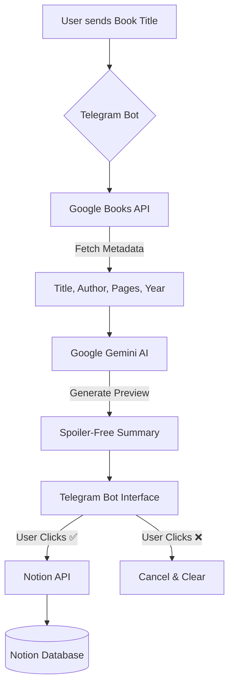

# 📖 NotionLibrarian

An AI-powered Telegram bot that helps you organize your personal library. Send a book title, receive an AI-generated spoiler-free preview, and save all metadata directly to your **Notion** database with one click.

---

## ✨ Features
* **Instant Metadata:** Fetches author, page count, and publication year automatically.
* **AI Previews:** Uses **Google Gemini AI** to generate concise, spoiler-free book summaries.
* **Notion Integration:** Automatically creates a new entry in your Notion database with all book details.
* **Interactive UI:** Uses Telegram's inline buttons for a smooth "Confirm/Cancel" workflow.

---

## 🛠️ Project Structure
```text
Book_bot/
├── notebooks/
│   ├── telegram_bot.py    # Main bot logic and Telegram handlers
│   └── to_notion.py       # API logic (Gemini & Notion)
├── .env.example           # Template for your secrets (Public)
├── .gitignore             # Prevents private secrets from being uploaded
├── requirements.txt       # Necessary Python libraries
└── README.md              # Project documentation
```
---

## 🤖 The Workflow (How it Works)

This bot connects four different platforms to automate your reading list. Here is the technical scheme:



## 🚀 Getting Started

### 1. Prerequisites
* **Python 3.10+**
* [Telegram Bot Token](https://t.me/BotFather)
* [Gemini API Key](https://aistudio.google.com/)
* [Notion Integration Token](https://www.notion.so/my-integrations)

### 2. ✅ Important (Notion Template Required)

Before using this project, you **must** create your Notion database using the provided template:

**Notion template (duplicate it first):**  
https://olive-windflower-821.notion.site/2d06bb3c158781f09512f9a1ab4e4c34?v=2d06bb3c158781edaced000c8010d97c

**Steps:**
1. Open the link and **Duplicate** the template into your own Notion workspace.
2. Use the duplicated database as your personal library database.
3. Share the duplicated database with your Notion integration (so the bot can write into it).
4. Copy your database ID and put it into `NOTION_DATABASE_ID` in your `.env`.

### 3. Installation
Clone the repository and install the dependencies:

```bash
git clone https://github.com/4bakhti/NotionLibrarian.git
cd NotionLibrarian
pip install -r requirements.txt
```

### 4. Environment Setup
Create a `.env` file in the same directory as your scripts:

1. Copy the contents of `.env.example` into a new file named `.env`.
2. Fill in your actual API keys:

```env
TELEGRAM_BOT_TOKEN=your_real_token_here
GEMINI_API_KEY=your_real_gemini_key_here
NOTION_API_KEY=your_real_notion_key_here
NOTION_DATABASE_ID=your_real_database_id_here
```
---
## 📖 Usage
1. **Run the bot:**
   ```bash
   python code/telegram_bot.py
   ```
2. Interact: Open your bot in Telegram and send a book title (e.g., "Harry Potter and the Philosopher's Stone").

3. Confirm: Review the AI-generated summary and click ✅ Add to Notion.
---

## 🛡️ Security
This project uses a `.gitignore` to ensure your `.env` file is **never** uploaded to GitHub. 

---

## 🤝 Contributing
Contributions, issues, and feature requests are welcome! Feel free to check the issues page or open a pull request.
